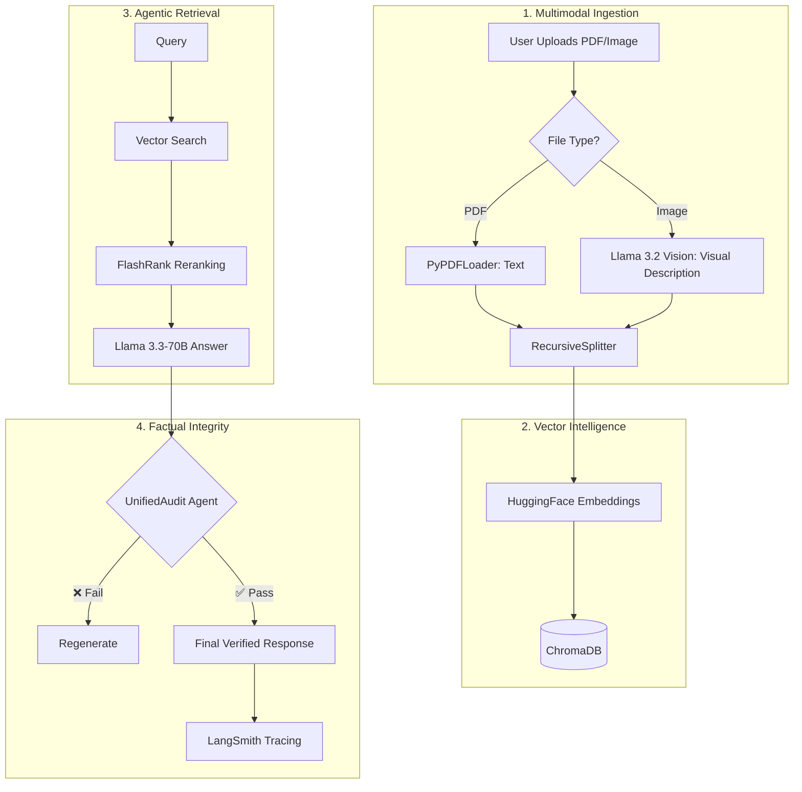

# 👁️ VeriSource AI: Multimodal Agentic RAG Platform

> **Live Demo:** [verichat-ai.streamlit.app](https://verichat-ai.streamlit.app/)  
> **Observability:** [LangSmith Public Trace](https://smith.langchain.com/public/deb15ebb-f273-4024-aa98-0211a125940a/r)

## ## 🏗️ System Architecture
VeriSource AI utilizes a high-performance pipeline to ensure factual accuracy and low latency. 


* **Inference:** Powered by **Groq LPU** for sub-500ms response times.
* **Verification:** Integrated **Agentic Auditor** that cross-references LLM outputs with retrieved PDF/Image context.
* **Observability:** Full-stack tracing via **LangSmith** to monitor reasoning chains.

---

## ## 🚀 Core Features
* **🎙️ Voice-Activated:** Integrated **Whisper-large-v3** for real-time speech-to-text queries.
* **🖼️ Multimodal Vault:** Ingest and reason over PDFs and Images (charts/diagrams) using **Llama 3.2 Vision**.
* **🛡️ Hallucination Guardrails:** A secondary auditor agent verifies every claim before display.
* **📜 Audit Trails:** Session logs are recorded and available for download to ensure data transparency.



## ## 🛠️ Technical Stack
| Category | Technology |
| :--- | :--- |
| **Framework** | LangChain, Streamlit |
| **Models** | Llama 3.3-70B, Llama 3.2-11B, Whisper-v3 |
| **Database** | ChromaDB (Vector Store) |
| **Monitoring** | LangSmith |
| **Reranking** | FlashRank |

---

## ## 📦 Installation
1. **Clone the repo:**
   ```bash
   git clone [https://github.com/KolliparaSaiSandeep/Verichat---Advanced.git](https://github.com/KolliparaSaiSandeep/Verichat---Advanced.git)
2. **Install requirements:**

   ```bash
   pip install -r requirements.txt

3. Set your Secrets: Add GROQ_API_KEY and LANGCHAIN_API_KEY to your .env file.

4.Run:
  ```bash

  streamlit run verichat-final.py
